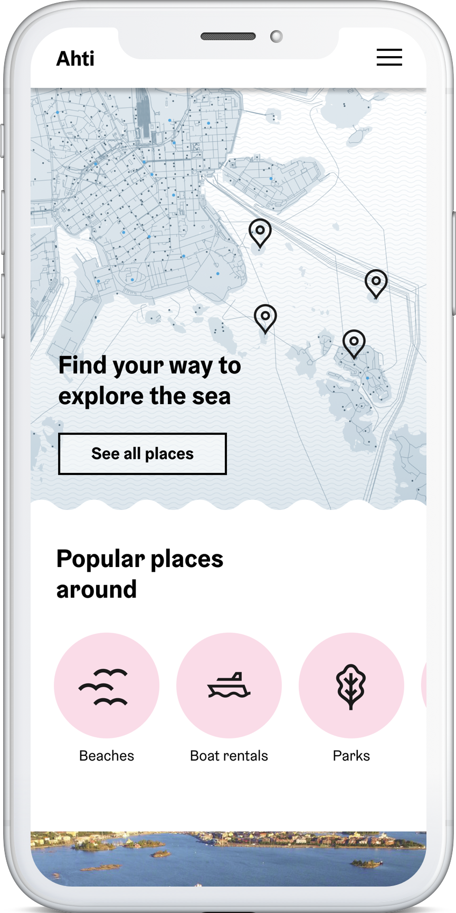

# Helsinki City Ahti project

## last updated 17-07-2019

## General information

https://drive.google.com/open?id=1Rghr1WjKDJs0Vmbkmp1yLyF6IxmX5lGn

### Scope of the project

For now scope of the project includes:

- map with markers of places
- list of places of interest by type and category
- views and UIs that comply with Helsinki City brand guidelines
- localization

Not in scope:

- accesibility
- server site rendering
- visual and programmatic testing
- UX reserach and multiple use cases

## Design sources

Are in Figma https://www.figma.com/file/ZKAH36THbAPVs9gNdmH8N6Dh/Ahti?node-id=0%3A1

## Map

The map we use is Mapbox:

- minimal style: `mapbox://styles/strawshield/cjxx7z1sf04rm1dl7bjryf4xf` by Olli Kilpi

## Data

In order to create data we use [geojson.io](geojson.io)

http://geojson.io/#map=12/60.1367/24.9237

The file is in /src/mapData.geojson that is remporarily changed to `.json` for import reasons

We filter data by data types and tags. So far the types that we have are:

- 'beach'
- 'restaurant'
- 'island'
- 'cafe'
- 'church'

We can add locations manually to mapData.json file
The script to check file is at ./src/scripts/mapDataManager.js
also runs on commit as a hook.

### TODO

Add these locations:

Beaches
https://theculturetrip.com/europe/finland/articles/7-beaches-you-need-to-visit-in-helsinki/
https://www.hel.fi/helsinki/en/culture/sports/outdoor/outdoor-swimming/
https://www.hel.fi/helsinki/en/culture/sports/outdoor/outdoor-swimming/nudist-beaches
https://ulkoliikunta.fi/
https://www.hel.fi/helsinki/en/culture/sports/outdoor/outdoor-swimming/quality

## Technical details

This project was bootstrapped with [Create React App](https://github.com/facebook/create-react-app).

## Available Scripts (we use yarn instead of npm)

### `yarn start`

Runs the app in the development mode. 
Open [http://localhost:3000](http://localhost:3000) to view it in the browser.

The page will reload if you make edits. 
You will also see any lint errors in the console.

### `yarn build`

Builds the app for production to the `build` folder. 
It correctly bundles React in production mode and optimizes the build for the best performance.

The build is minified and the filenames include the hashes. 
Your app is ready to be deployed!

See the section about [deployment](https://facebook.github.io/create-react-app/docs/deployment) for more information.

### `npm run eject` WE DID NOT DO IT YET AND NOT REALLY SURE IF WE NEED TO

**Note: this is a one-way operation. Once you `eject`, you can’t go back!**

If you aren’t satisfied with the build tool and configuration choices, you can `eject` at any time. This command will remove the single build dependency from your project.

Instead, it will copy all the configuration files and the transitive dependencies (Webpack, Babel, ESLint, etc) right into your project so you have full control over them. All of the commands except `eject` will still work, but they will point to the copied scripts so you can tweak them. At this point you’re on your own.

You don’t have to ever use `eject`. The curated feature set is suitable for small and middle deployments, and you shouldn’t feel obligated to use this feature. However we understand that this tool wouldn’t be useful if you couldn’t customize it when you are ready for it.

## Learn More

You can learn more in the [Create React App documentation](https://facebook.github.io/create-react-app/docs/getting-started).

## Deployment

We deploy using Netlify. The repository is already linked to Netlify instance.
Some rules:

1. Include variables from .env file into deploy rules
2. Make sure you deploy from master branch
3. Make sure you deploy from `build` folder
4. Make sure your `yarn build` script in package.json is like this: "build": "react-scripts build && echo '/\* /index.html 200' | cat >build/\_redirects" if you are ranning a non-SSRed version of create-react-app (the one we have now) otherwise things will crushhhhhhhhhh

To setup deploy from CLI, do:
`npm install netlify-cli -g netlify deploy`
